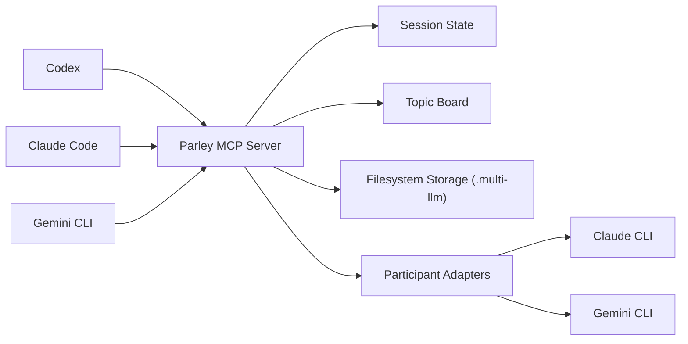

# Parley

> Orchestrator-agnostic MCP server for multi-LLM parley sessions across Codex, Claude, and Gemini.

[](https://github.com/Micehub-dev/parley-mcp/actions/workflows/ci.yml)
[](./LICENSE)
[](https://nodejs.org/)
[](https://modelcontextprotocol.io/)


Parley is a **Model Context Protocol (MCP) server** designed for **multi-agent and multi-LLM parley workflows**. It gives `Codex`, `Claude`, and `Gemini` a shared orchestration contract so parley sessions can be started, resumed, coordinated, and archived without locking the project into a single client or vendor-specific extension model.

If you are looking for a **TypeScript MCP server template** for **AI parley orchestration**, **Claude/Gemini interoperability**, or **workspace-level session memory**, this repository is built for that exact problem space.

## Why Parley

Most AI tooling gets trapped inside one client surface. Parley takes the opposite approach:

- The server owns session state, not the client.
- Parley steps are driven by MCP tools, not UI-specific commands.
- Claude, Gemini, and future participants can be normalized behind one contract.
- Workspace memory survives any single orchestrator session.
- The architecture is ready for later expansion into plugins, extensions, web UIs, or hosted coordination services.

## Highlights

- Orchestrator-agnostic MCP server
- Filesystem-backed workspace, topic, and parley session storage
- Lease and `stateVersion` primitives for safe concurrent orchestration
- Structured tool surface for topic creation, search, board retrieval, session start, state lookup, lease claiming, diagnostics inspection, and session progression
- TypeScript + Zod-based validation for predictable inputs and outputs
- Real `claude` and `gemini` subprocess adapter boundary with shared structured output validation
- Resume ID persistence and last-turn response snapshots for multi-step session continuation
- Rolling summary accumulation across successful turns
- Structured finish-time conclusions and explicit topic promotion into workspace memory
- Topic-memory search across promoted summaries, open questions, action items, and tags
- Workspace board digests for status-oriented topic retrieval
- Operator-facing diagnostic inspection with replay and repair guidance
- Redacted-by-default diagnostic MCP views with explicit full-detail opt-in for local debugging
- Next-safe repair actions derived from persisted diagnostics for replay-boundary follow-up
- Participant subprocess timeout, termination, and output-size guardrails
- Atomic JSON persistence for session, topic, lease, and diagnostic artifacts
- Explicit corrupted-artifact visibility on session and topic reads

## Architecture



## Current Status

The repository is currently at the **Windows-first production-readiness hardening** stage.

- MCP server skeleton and core session lifecycle are implemented
- Filesystem-backed storage is implemented
- `parley_step` executes participant adapters and validates shared structured responses
- Session state persists participant `resumeId` values and `latestTurn` snapshots
- Session state also persists a structured `rollingSummary` for downstream orchestration and promotion
- `parley_finish` returns a structured `conclusion` while keeping `summary` as a compatibility field
- `parley_promote_summary` promotes finished-session conclusions into linked topic memory
- `parley_search_topics` retrieves promoted topic memory across summaries, questions, actions, and tags
- `parley_get_workspace_board` exposes board-style workspace digests for downstream clients
- `parley_list_diagnostics` exposes failed step diagnostics with operator repair guidance and next-safe tool actions
- `parley_list_diagnostics` now redacts raw subprocess details by default and requires explicit `detailLevel: "full"` opt-in for full MCP detail
- participant subprocesses now enforce timeout, kill-grace, and output-size guardrails with environment-variable overrides for operators
- filesystem reads now distinguish missing artifacts from invalid or unreadable ones instead of collapsing them into a generic null path
- rolling summary, conclusion, and promoted topic memory now deduplicate repeated questions/action items and emit more compact synthesis text
- stdio integration coverage now exercises participant resume reuse and lease-conflict handling across orchestrator-labeled runs
- Structured MCP tool errors now return machine-readable JSON envelopes with `isError: true`
- Failed participant attempts persist debug-friendly diagnostics under `.multi-llm/sessions/<sessionId>/diagnostics/`
- Service and adapter tests cover happy-path execution, retrieval, diagnostics, and key failure modes
- Stdio MCP integration coverage now exercises `start -> claim_lease -> step -> finish -> promote -> search -> board`, resume reuse, and lease-conflict scenarios
- `npm run smoke:real` now passes on a Windows local environment using `claude.exe` together with the npm-installed `gemini.cmd` shim
- a live Codex Desktop installation and MCP usage pass has now verified server registration, lease flow, step execution, diagnostics inspection, and real participant execution on Windows
- GitHub Actions CI now exercises lint, typecheck, test, and build on `ubuntu-latest` as the current Linux automation evidence path
- Gemini normalization now recovers common markdown-fenced JSON, labeled plain-text, and partial JSON response shapes without widening the shared contract
- Gemini usefulness hardening now adds stronger anti-fallback prompting, targeted regression coverage, and smoke-time usefulness classification without widening the shared contract
- `npm run smoke:real` now emits release-evidence metadata including launcher details, OS facts, and Gemini usefulness classification
- CI is configured for install, lint, test, typecheck, and build
- Sprint 10 planning is now focused on exercised real-environment evidence, Gemini operator usefulness in real smoke, and repeatable release-evidence collection rather than new product surface area

## Repository Layout

```text
.
|-- .github/workflows/ci.yml
|-- .multi-llm/
|-- docs/
|-- src/
|   |-- index.ts
|   |-- server.ts
|   |-- config.ts
|   |-- participants/
|   |-- services/
|   |-- storage/fs-store.ts
|   `-- types.ts
|-- test/
|-- AGENTS.md
|-- LICENSE
|-- README.md
`-- multi-cli-parley-architecture.md
```

## Quick Start

### Requirements

- Node.js 22+
- npm 10+

### Install

```bash
npm install
```

### Validate

```bash
npm test
npm run lint
npm run typecheck
npm run build
npm run smoke:real
```

### Run

```bash
npm run dev
```

Parley stores local project data under `.multi-llm/`, including workspace metadata, parley sessions, transcripts, and topic records.

## Operational Notes

- Supported transport today: stdio MCP only
- Current automated Linux evidence comes from GitHub Actions on `ubuntu-latest`
- Current real-environment operator evidence comes from Windows local `npm run smoke:real` plus the Codex Desktop acceptance pass
- macOS remains unverified; keep support wording narrow until an actual macOS environment is exercised
- `npm run smoke:real` now defaults to a release-oriented production-readiness prompt and records `participantLaunches` plus `geminiUsefulness` in its output
- Current next-step focus is to add exercised Linux evidence only when a real Linux participant environment is available, improve Gemini response usefulness during real smoke, and keep release evidence easier to review
- Default participant guardrails:
  - `PARLEY_PARTICIPANT_TIMEOUT_MS=120000`
  - `PARLEY_PARTICIPANT_MAX_OUTPUT_BYTES=1000000`
  - `PARLEY_PARTICIPANT_KILL_GRACE_MS=1000`
- On Windows, Parley now prefers the npm-installed `gemini.cmd` shim automatically when it is available under `%APPDATA%\\npm`.
- If only `gemini.ps1` is available, operators may still need `PARLEY_GEMINI_COMMAND` and `PARLEY_GEMINI_ARGS_JSON` overrides.
- Corrupted or unreadable persisted artifacts now surface explicit `storage_failure` details instead of silently disappearing from read APIs.

## Documentation

- `AGENTS.md`: onboarding guide for coding agents and contributors
- `docs/codex-desktop-acceptance.md`: repeatable Codex Desktop installation and baseline operator verification flow
- `docs/project-operating-plan.md`: PM-oriented roadmap, sprint structure, and prioritization
- `docs/mcp-contract-spec.md`: MCP contract source of truth
- `docs/real-cli-smoke.md`: release-oriented real CLI smoke workflow and latest observed result
- `docs/release-evidence-template.md`: repeatable note template for smoke, acceptance, and support-boundary evidence
- `docs/release-checklist.md`: release runbook for preflight, rollout, rollback, and post-release review
- `docs/sprints/2026-sprint-10.md`: current production-readiness sprint focused on evidence, Gemini usefulness, and release operationalization
- `multi-cli-parley-architecture.md`: architecture rationale and long-form design

## Roadmap

- Add a real Linux CLI evidence path only when an actual Linux participant environment is available
- Improve Gemini operator usefulness in real smoke without widening the shared participant contract
- Keep smoke, Codex Desktop acceptance, test matrix, and release docs aligned as one release-evidence workflow
- Validate macOS only from an exercised macOS environment; keep the support statement narrow until then
- Package thin surfaces for plugins, extensions, and future UI layers only after the stronger Sprint 10 production-use evidence bar remains stable

## Use Cases

- AI research debates across multiple model providers
- structured architecture discussions between coding agents
- persistent topic boards for technical decisions
- orchestrator-neutral MCP experimentation
- multi-agent workflow prototypes for Claude, Gemini, and Codex

## License

Released under the [MIT License](./LICENSE).
