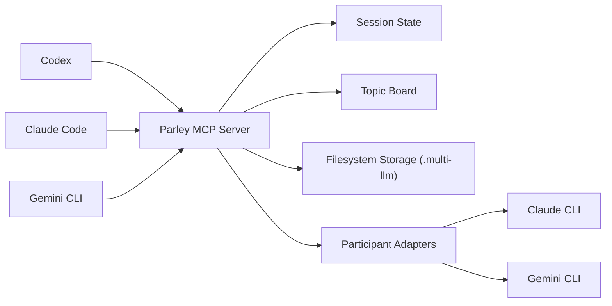

# Parley

> Orchestrator-agnostic MCP server for multi-LLM parley sessions across Codex, Claude, and Gemini.

[](https://github.com/Micehub-dev/parley-mcp/actions/workflows/ci.yml)
[](./LICENSE)
[](https://nodejs.org/)
[](https://modelcontextprotocol.io/)


Parley is a **Model Context Protocol (MCP) server** designed for **multi-agent and multi-LLM parley workflows**. It gives `Codex`, `Claude`, and `Gemini` a shared orchestration contract so parley sessions can be started, resumed, coordinated, and archived without locking the project into a single client or vendor-specific extension model.

If you are looking for a **TypeScript MCP server template** for **AI parley orchestration**, **Claude/Gemini interoperability**, or **workspace-level session memory**, this repository is built for that exact problem space.

## Why Parley

Most AI tooling gets trapped inside one client surface. Parley takes the opposite approach:

- The server owns session state, not the client.
- Parley steps are driven by MCP tools, not UI-specific commands.
- Claude, Gemini, and future participants can be normalized behind one contract.
- Workspace memory survives any single orchestrator session.
- The architecture is ready for later expansion into plugins, extensions, web UIs, or hosted coordination services.

## Highlights

- Orchestrator-agnostic MCP server
- Filesystem-backed workspace, topic, and parley session storage
- Lease and `stateVersion` primitives for safe concurrent orchestration
- Structured tool surface for topic creation, search, board retrieval, session start, state lookup, lease claiming, diagnostics inspection, and session progression
- TypeScript + Zod-based validation for predictable inputs and outputs
- Real `claude` and `gemini` subprocess adapter boundary with shared structured output validation
- Resume ID persistence and last-turn response snapshots for multi-step session continuation
- Rolling summary accumulation across successful turns
- Structured finish-time conclusions and explicit topic promotion into workspace memory
- Topic-memory search across promoted summaries, open questions, action items, and tags
- Workspace board digests for status-oriented topic retrieval
- Operator-facing diagnostic inspection with replay and repair guidance

## Architecture



## Current Status

The repository is currently at the **operator-tooling and knowledge-layer expansion** stage.

- MCP server skeleton and core session lifecycle are implemented
- Filesystem-backed storage is implemented
- `parley_step` executes participant adapters and validates shared structured responses
- Session state persists participant `resumeId` values and `latestTurn` snapshots
- Session state also persists a structured `rollingSummary` for downstream orchestration and promotion
- `parley_finish` returns a structured `conclusion` while keeping `summary` as a compatibility field
- `parley_promote_summary` promotes finished-session conclusions into linked topic memory
- `parley_search_topics` retrieves promoted topic memory across summaries, questions, actions, and tags
- `parley_get_workspace_board` exposes board-style workspace digests for downstream clients
- `parley_list_diagnostics` exposes failed step diagnostics with operator repair guidance
- Structured MCP tool errors now return machine-readable JSON envelopes with `isError: true`
- Failed participant attempts persist debug-friendly diagnostics under `.multi-llm/sessions/<sessionId>/diagnostics/`
- Service and adapter tests cover happy-path execution, retrieval, diagnostics, and key failure modes
- Stdio MCP integration coverage now exercises `start -> claim_lease -> step -> finish -> promote -> search -> board`
- CI is configured for install, lint, test, typecheck, and build

## Repository Layout

```text
.
|-- .github/workflows/ci.yml
|-- .multi-llm/
|-- docs/
|-- src/
|   |-- index.ts
|   |-- server.ts
|   |-- config.ts
|   |-- participants/
|   |-- services/
|   |-- storage/fs-store.ts
|   `-- types.ts
|-- test/
|-- AGENTS.md
|-- LICENSE
|-- README.md
`-- multi-cli-parley-architecture.md
```

## Quick Start

### Requirements

- Node.js 22+
- npm 10+

### Install

```bash
npm install
```

### Validate

```bash
npm test
npm run lint
npm run typecheck
npm run build
```

### Run

```bash
npm run dev
```

Parley stores local project data under `.multi-llm/`, including workspace metadata, parley sessions, transcripts, and topic records.

## Documentation

- `AGENTS.md`: onboarding guide for coding agents and contributors
- `docs/project-operating-plan.md`: PM-oriented roadmap, sprint structure, and prioritization
- `docs/mcp-contract-spec.md`: MCP contract source of truth
- `multi-cli-parley-architecture.md`: architecture rationale and long-form design

## Roadmap

- Refine topic-memory quality and repair ergonomics on top of the stable Sprint 5 surface
- Broaden orchestrator verification beyond the current Windows-first matrix
- Package thin surfaces for plugins, extensions, and future UI layers

## Use Cases

- AI research debates across multiple model providers
- structured architecture discussions between coding agents
- persistent topic boards for technical decisions
- orchestrator-neutral MCP experimentation
- multi-agent workflow prototypes for Claude, Gemini, and Codex

## License

Released under the [MIT License](./LICENSE).
