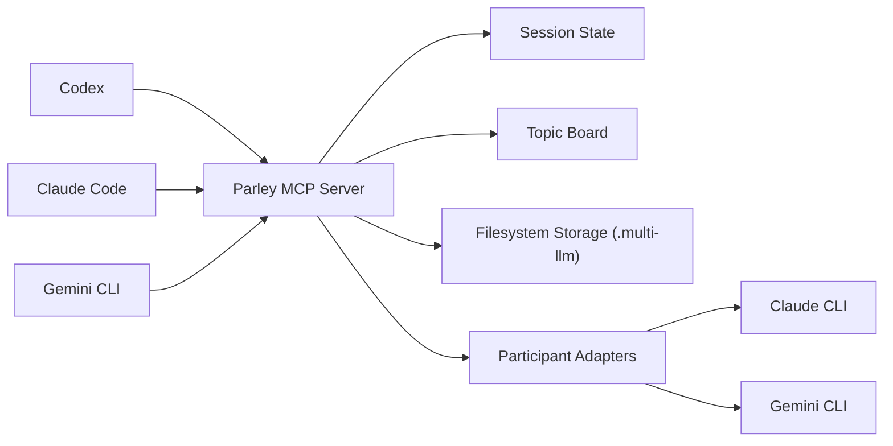

# Parley

> Orchestrator-agnostic MCP server for multi-LLM debate sessions across Codex, Claude, and Gemini.

[](https://github.com/Micehub-dev/parley-mcp/actions/workflows/ci.yml)
[](./LICENSE)
[](https://nodejs.org/)
[](https://modelcontextprotocol.io/)


Parley is a **Model Context Protocol (MCP) server** designed for **multi-agent and multi-LLM debate workflows**. It gives `Codex`, `Claude`, and `Gemini` a shared orchestration contract so debate sessions can be started, resumed, coordinated, and archived without locking the project into a single client or vendor-specific extension model.

If you are looking for a **TypeScript MCP server template** for **AI debate orchestration**, **Claude/Gemini interoperability**, or **workspace-level session memory**, this repository is built for that exact problem space.

## Why Parley

Most AI tooling gets trapped inside one client surface. Parley takes the opposite approach:

- The server owns session state, not the client.
- Debate steps are driven by MCP tools, not UI-specific commands.
- Claude, Gemini, and future participants can be normalized behind one contract.
- Workspace memory survives any single orchestrator session.
- The architecture is ready for later expansion into plugins, extensions, web UIs, or hosted coordination services.

## Highlights

- Orchestrator-agnostic MCP server
- Filesystem-backed workspace, topic, and debate session storage
- Lease and `stateVersion` primitives for safe concurrent orchestration
- Structured tool surface for topic creation, session start, state lookup, and debate progression
- TypeScript + Zod-based validation for predictable inputs and outputs
- Clear path toward real `claude` and `gemini` subprocess adapters

## Architecture



## Current Status

The repository is currently at the **MVP scaffold** stage.

- MCP server skeleton is implemented
- Filesystem-backed storage is implemented
- Project operating docs and agent onboarding docs are included
- `debate_step` is scaffolded and ready for real participant execution work
- CI is configured for install, typecheck, and build

## Repository Layout

```text
.
|-- .github/workflows/ci.yml
|-- .multi-llm/
|-- docs/
|-- src/
|   |-- index.ts
|   |-- server.ts
|   |-- config.ts
|   |-- storage/fs-store.ts
|   `-- types.ts
|-- AGENTS.md
|-- LICENSE
|-- README.md
`-- multi-cli-debate-architecture.md
```

## Quick Start

### Requirements

- Node.js 22+
- npm 10+

### Install

```bash
npm install
```

### Validate

```bash
npm run typecheck
npm run build
```

### Run

```bash
npm run dev
```

Parley stores local project data under `.multi-llm/`, including workspace metadata, debate sessions, transcripts, and topic records.

## Documentation

- `AGENTS.md`: onboarding guide for coding agents and contributors
- `docs/project-operating-plan.md`: PM-oriented roadmap, sprint structure, and prioritization
- `docs/mcp-contract-spec.md`: MCP contract source of truth
- `multi-cli-debate-architecture.md`: architecture rationale and long-form design

## Roadmap

- Complete the core session lifecycle and error taxonomy
- Add real `claude` / `gemini` subprocess adapters
- Add rolling summaries and debate conclusion generation
- Expand workspace memory, topic boards, and search
- Package thin surfaces for plugins, extensions, and future UI layers

## Use Cases

- AI research debates across multiple model providers
- structured architecture discussions between coding agents
- persistent topic boards for technical decisions
- orchestrator-neutral MCP experimentation
- multi-agent workflow prototypes for Claude, Gemini, and Codex

## License

Released under the [MIT License](./LICENSE).
